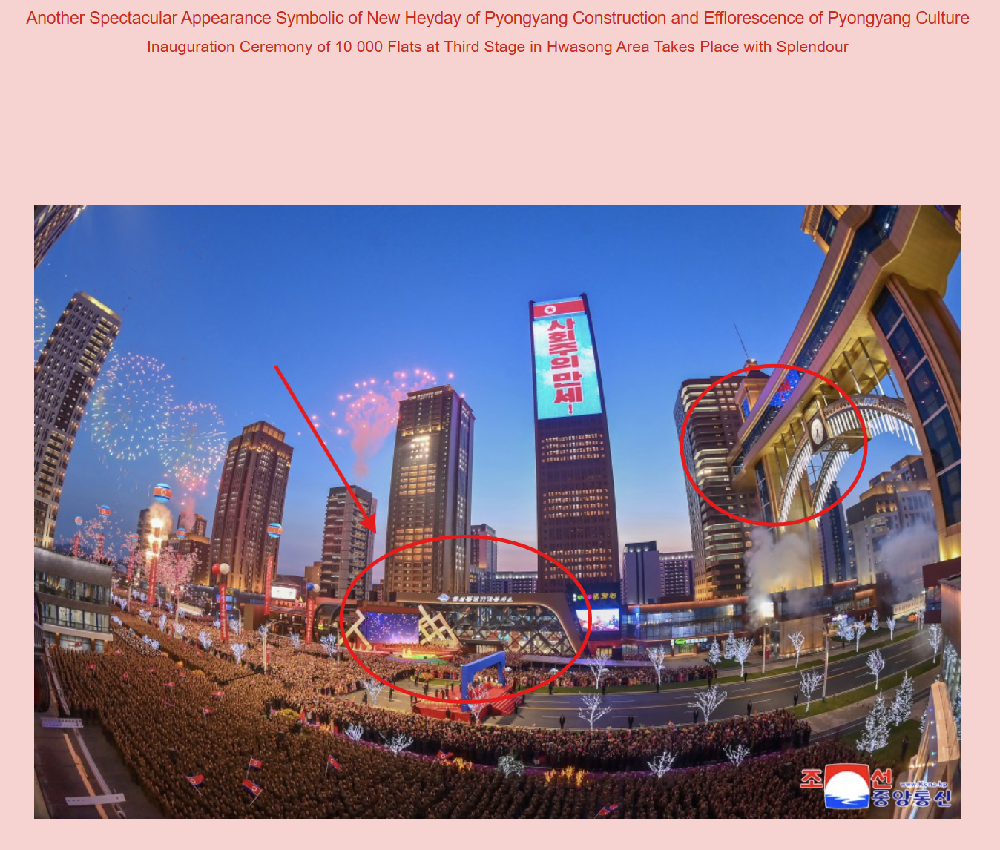
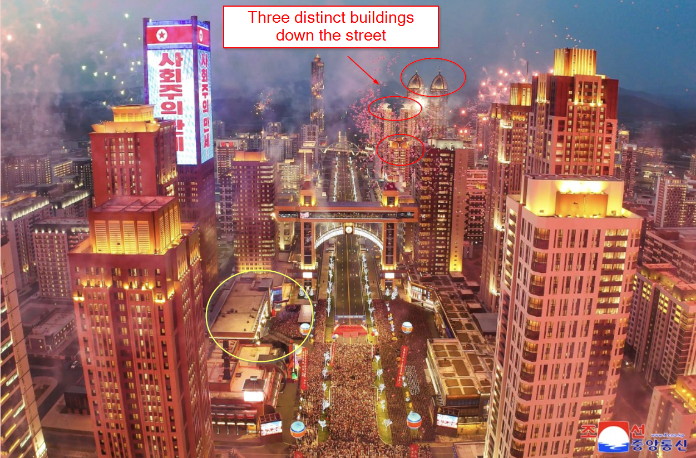

# Inspo 💅
### Description
We believe that the North Torbians are heavily influenced by North Korean developments and wish to match them. We have suspicions that Juche Jaguar will try to build out similar spaces to ones in these pictures. Can you find the coordinates of where these pictures were taken?

The flag is any valid [decimal degree coordinate notation](https://en.wikipedia.org/wiki/Decimal_degrees) within a 1-km radius of the building. The flag is in the following format:
`C1{XX.XXX,XX.XXX}`

For example, the White House would be at decimal degree notion of 38.897, -77.036. The flag for the White House would be:
`C1{38.897,-77.036}`

# Hints
1. These photos involve information from a major North Korean press release. What information is shared about this, are there any identifiable archetecture items? https://www.nknews.org/2025/04/kim-jong-un-vows-cars-and-gaming-for-core-citizens-but-whats-behind-the-pitch/
2. This is a newer development in north eastern Pyongyang. However, the most recent satellite photos on Google Earth or Bing do not have thes buildings present. What other items in the background can help geolocate?

# Solution
This photo was released as a part of a major press release for a North Korean building project. When reviewing these press releases, it was noted that this is for the [Hwasong residential project in northern Pyongyang](https://www.nknews.org/2025/04/kim-jong-un-vows-cars-and-gaming-for-core-citizens-but-whats-behind-the-pitch/). The skyscraper bridge in the second photo is not currently within Google Maps satellite photos, but can be determined through the background buildings of other photos.

Additional photos from the press release show the front of the building with the computer club. This building appears to have an interesting cross-hatch shaped pattern. 

https://assets.korearisk.com/uploads/2025/04/kcna-apr4-2025-2k-kju-hwasong-street-stage4-inspection-before-opening-1.jpg

When reviewing other photos of the bridge, the cross-hatched building is found almost directly next to this skyscraper bridge.

However, this is not found within Google or Bing satellite images. Instead, we can see there's a few distinctive buildings in the background of photos of the bridge.

Further down the street, we can see that these are the same buildings and know how to orient ourselves correctly on the map.

https://www.mapdevelopers.com/draw-circle-tool.php?circles=%5B%5B1609.34%2C-16.2535158%2C-58.8413193%2C%22%23AAAAAA%22%2C%22%23000000%22%2C0.4%5D%2C%5B1609.34%2C39.0979726%2C125.7720511%2C%22%23AAAAAA%22%2C%22%23000000%22%2C0.4%5D%5D

http://kcna.kp/en/media/photo/q/3cec6f030141eeeae881e82864226c956ca6a02d5db5e7758149228de4156b4a.kcmsf

The answer is below:
`C1{39.095,125.766}`

Any match to the regex below is considered correct as well:
`C1{39\.(09|10)\d+,125\.(76|77)\d+}}`