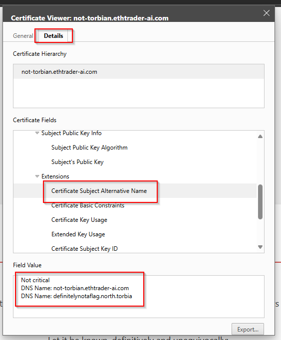

# Hoasted Toasted 🍞
## Description
This challenge tests your ability to identify and access virtual hosted servers using Nginx, TLS SAN fields, and host file manipulation.

## Challenge Story
We have discovered what we believe is a North Torbian public website and have suspicions there is a secret internal-only site hidden there as well. Your goal: Figure out how to connect to the hidden site and find the flag!

Author: m4lwhere

## Hints
1. Pay attention to the TLS certificate. Are there other hostnames on there? This may indicate Host-header injection vulnerabilities.
2. Certain TLDs cannot be resolved publicly, but can still be used to serve Virtual Hosted websites. Place the hostname resolution in your hosts file (`/etc/hosts` or `C:\Windows\system32\drivers\etc\hosts`) or use Burp's DNS resolution capabilities.

## What you need to do
1. **Visit the public site:**
   Go to https://not-torbian.ethtrader-ai.com/ in your browser. You will see the what is certainly not a North Torbian satirical homepage.
2. **Inspect the TLS certificate:**
   View the certificate's Subject Alternative Name (SAN) field. There is a hostname with a non-routable TLD (`definitelynotaflag.north.torbia`).
   
3. **Update your hosts file:**
   Add an entry to your `/etc/hosts` (or `C:\Windows\System32\drivers\etc\hosts`) to point the public IPv4 address of the host.
   Alternatively, Burp supports adding a DNS override into the system. This can be accessed via Settings > Network > DNS. Place the new hostname into the field with the resolved IP of `34.86.60.228`, since this is the IP on the publicly routable website.
4. **Access the internal site:**
   Visit https://definitelynotaflag.north.torbia/ in your browser. You will see the flag!

## Flag Submission
Scrolling down to the bottom of the secret page, you will see the flag is `C1{vH0st_S4n_M4g1c_R3ve4l3d}`.

